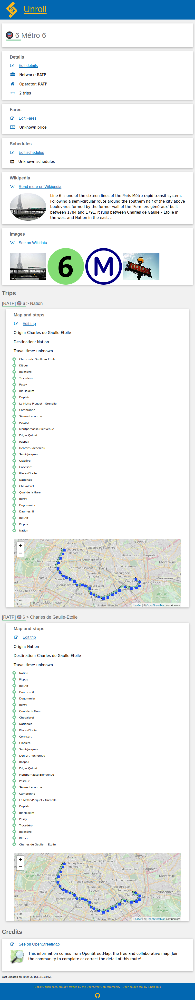
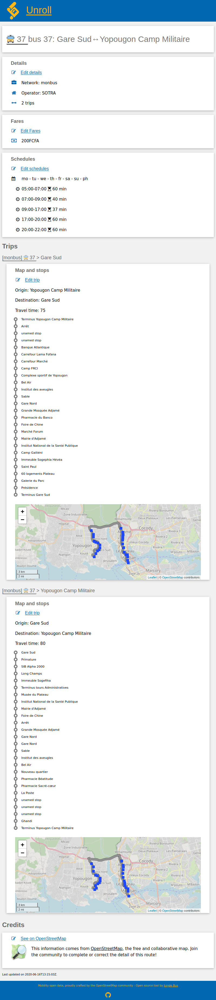
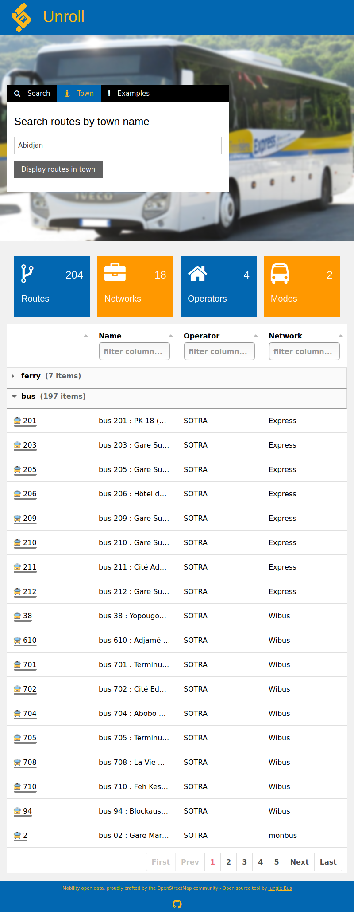

# Unroll

Unroll is a tool for viewing transport routes in OpenStreetMap. It allows you to search for transport routes and to display their details: attributes, trips, timetables, stops, shapes, etc.

## Contribute

Want to inspect routes in your own language ? [Translations happen here](https://www.transifex.com/jungle-bus/unroll)

## Goodies

* You can add `?qa=yes` to the route page url to display [Osmose issues](https://github.com/Jungle-Bus/transport_mapcss) (if any) about the route.
* On OSM wiki, you can display a link to the Unroll page of a route with the [Unroll template](https://wiki.openstreetmap.org/wiki/Template:Unroll) : `{{Unroll|rel=3328765|label=Metro 6}}`
* Use [Unroll load page](https://jungle-bus.github.io/unroll/load.html?ref:FR:STIF=C01298) to check `ref:FR:STIF` tag (Paris region open data codes)
* Use [Unroll bus_station page](https://jungle-bus.github.io/unroll/bus_station.html?bus_station_id=w148818296) for viewing bus station info

## Credits

This project has been developed by the [Jungle Bus](http://junglebus.io/) team.

The code in this repository is under the GPL-3.0 license.

The front cover image is adapted from a photo of a Transisère bus by Anthony Levrot, License CC BY-SA 4.0 (source picture on [Wikimedia Commons](https://commons.wikimedia.org/wiki/File:Iveco_Evadys_n%C2%B08288_(vue_avant_gauche)_-_Transis%C3%A8re_(Lumbin).jpg)).
 

